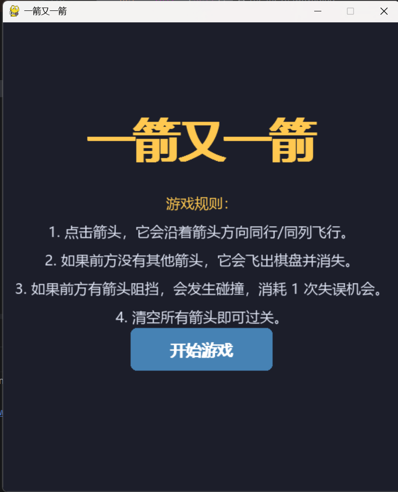
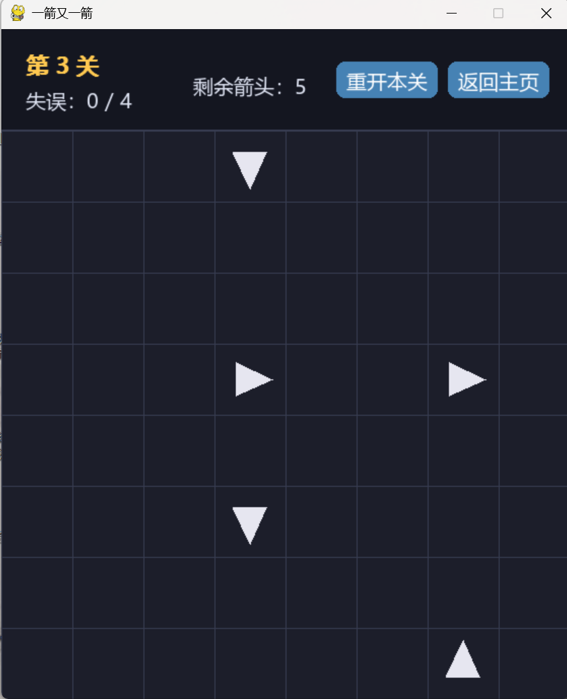
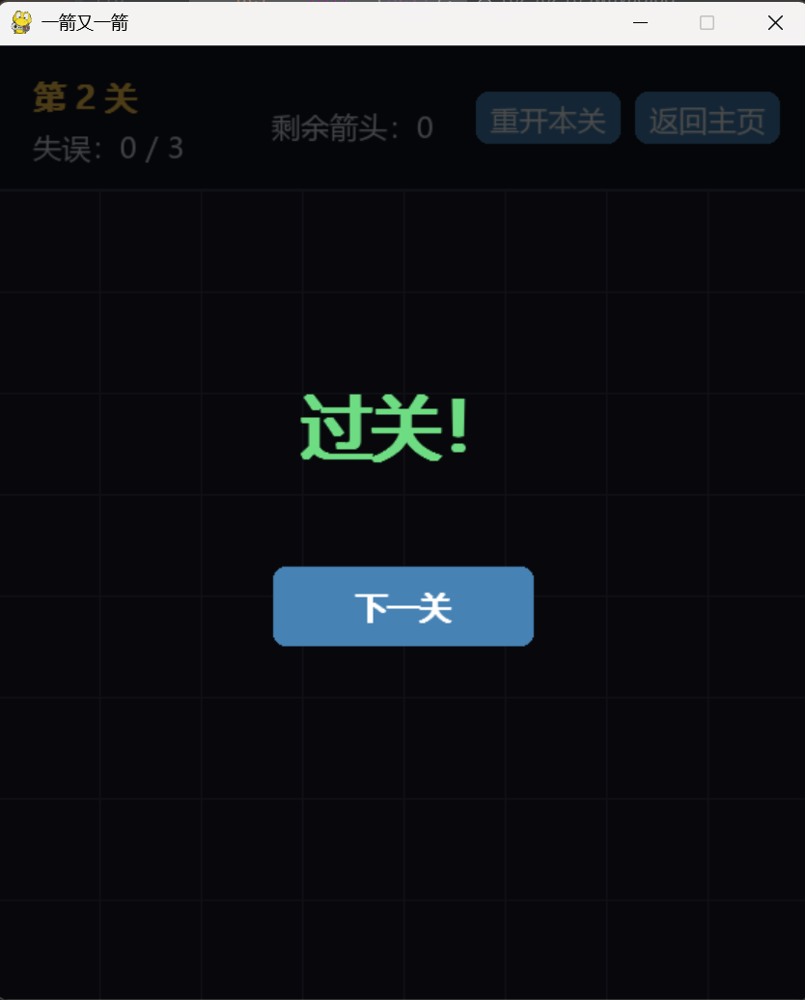
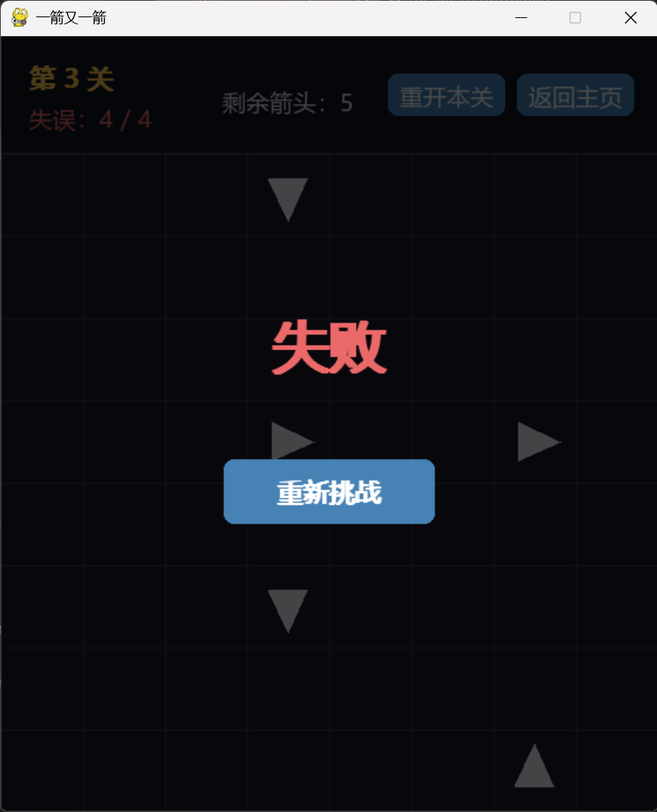

# 一箭又一箭 (Arrow Game)

## 项目简介
基于 Python 和 Pygame 开发的益智小游戏。玩家点击箭头，箭头会沿其方向飞行。如果前方无阻挡，箭头飞出棋盘；如果前方有阻挡，则发生碰撞并消耗失误次数。清空所有箭头即可过关。

## 开发环境
- 操作系统：Windows 10/11
- 编程语言：Python 3.9+
- 依赖库：pygame 2.6.1
- 开发工具：PyCharm

## 安装和运行方法
1. 安装依赖库：`pip install pygame`
2. 克隆或下载本仓库代码。
3. 在项目根目录运行：`python main.py`

## 游戏操作说明
- **鼠标左键**：点击箭头触发飞行

## 游戏截图
- 开始界面：
- 游戏界面：
- 结算界面：
- 失败界面：

## 项目结构
- `main.py`：游戏主入口
- `fangxiang.py`：方向与箭头类定义
- `lujing.py`：路径检测逻辑
- `guanqia.py`：关卡数据与切换
